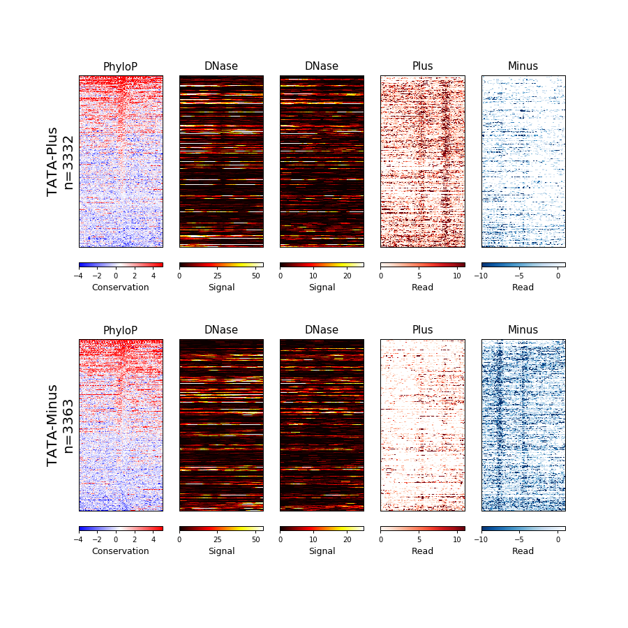

Wigman documentation
====================


[](https://travis-ci.org/AminMahpour/Wigman)
[](https://www.codacy.com/app/AminMahpour/Wigman?utm_source=github.com&amp;utm_medium=referral&amp;utm_content=AminMahpour/Wigman&amp;utm_campaign=Badge_Grade)
[](https://www.python.org/downloads/release/python-360/)
[](LICENSE)


Generate heatmap files from BigWig data.

## Example
### Run the script:
In order to run the plotting script, you need a config "instruction" file. The file
 should look like the following template:
```
Bed/Wig/pdf filename    min max step    colormap    title   description
```

My config.txt contains the following:
```
bed	hg19/tata_plus.bed	50	50	TATA-Plus
bed	hg19/tata_minus.bed	50	50	TATA-Minus
bw	hg19.100way.phyloP100way.bw	-4	4.02	2	BuRd	PhyloP	Conservation Score
bw	hg19.100way.phastCons.bw	0	1.02	0.5	Reds	PhastCons	Element Conservation
bw	ENCFF000SLA.bigWig	0	50.2	25	Hot	K562	Base Overlap Signal
bw	ENCFF000SPQ.bigWig	0	20.2	10	Hot	HeLa 	Base Overlap Signal
bw	GSM1480321_K562_GROcap_wTAP_plus.bigWig	0	10.2	5	Reds	Plus	Read
bw	GSM1480321_K562_GROcap_wTAP_minus.bigWig	-10	0.5	5	Blues	Minus	Read
pdf	tata_profile.png	size
```

Then run the following command:

```
main.py config.txt
```





