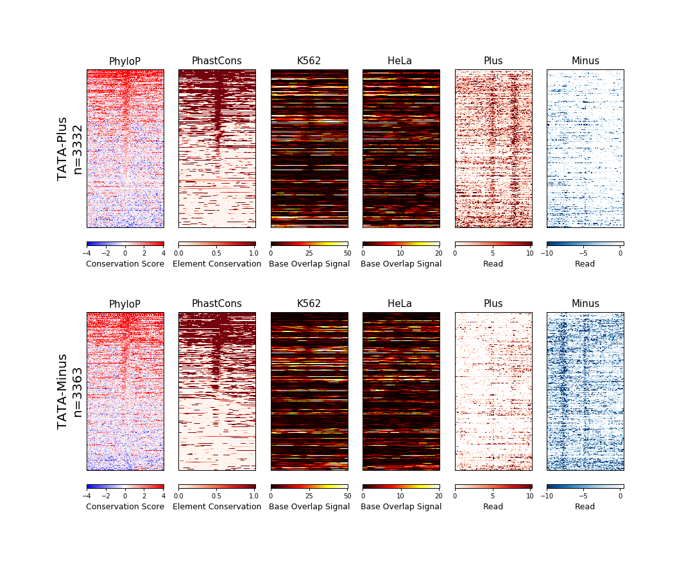

Wigman
======


Generate heatmap files from BigWig data.

## Example
### Run the script:
In order to run the plotting script, you meed a config file. The file
 should look like the following template:
```
Bed/Wig/pdf filename    min max step    title   description
```

config.txt contains the following:
```
bed	hg19/tata_plus.bed	50	50	TATA-Plus
bed	hg19/tata_minus.bed	50	50	TATA-Minus
bw	hg19.100way.phyloP100way.bw	-4	5	2	BuRd	PhyloP	Conservation
bw	ENCFF000SLA.bigWig	0	55	25	Hot	DNase	Signal
bw	ENCFF000SPQ.bigWig	0	25	10	Hot	DNase	Signal
bw	GSM1480321_K562_GROcap_wTAP_plus.bigWig	0	11	5	Reds	Plus	Read
bw	GSM1480321_K562_GROcap_wTAP_minus.bigWig	-10	1	5	Blues	Minus	Read
pdf	tata_profile.png	size
```

Then run the command:

```
main.py config.txt
```





